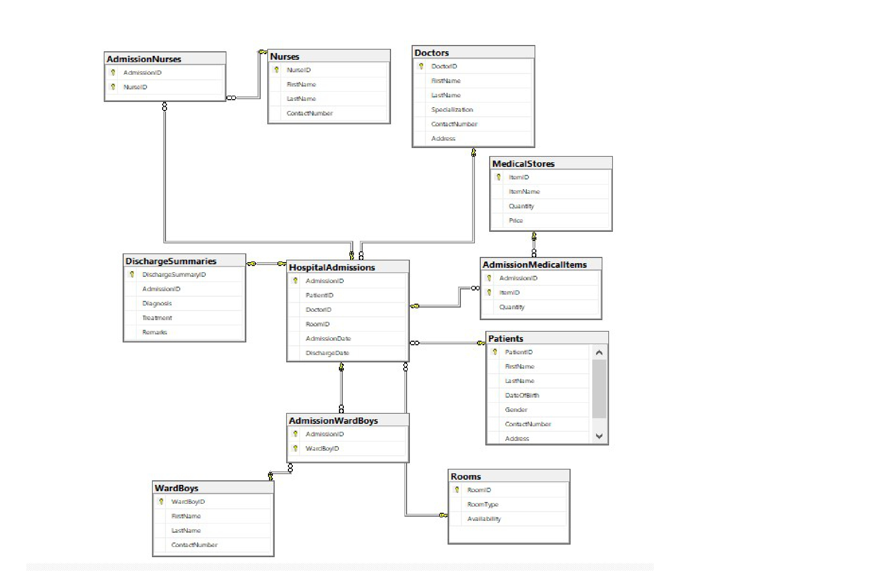

# Hospital Management System Project Description

## Overview
The Hospital Management System is a comprehensive web-based software designed to streamline and optimize the operations of a medical setup. It facilitates the systematic management of patients, doctors, rooms, and other essential aspects of hospital administration. The system ensures a standardized record-keeping process, enabling efficient control by the administrator.

## Project Objectives
1. **Analysing Database and Creating Conceptual Schemas**: Conducted thorough analysis of the database requirements and devised conceptual schemas to represent the underlying structure effectively.
   
2. **Decomposing Tables to Space Oriented**: Employed techniques to optimize space utilization by decomposing tables to their minimum required form, ensuring efficient storage management.

3. **Table Relationships Description**: Clearly described the relationships between different tables within the database, including one-to-one, one-to-many, and many-to-many relationships, to maintain data integrity and coherence.

4. **Identifying Super Keys**: Identified and documented all super keys within the database, essential for uniquely identifying records in a table.

5. **Utilizing Constraints**: Applied various types of constraints such as primary key, foreign key, check, and unique constraints to enforce data integrity and ensure consistency across the database.

6. **Procedure Creation**: Developed procedures to automate and streamline essential functions within the system, enhancing operational efficiency and facilitating seamless execution of tasks.

## Project Visualization
To visualize the database schema and its connections, please refer to the following  to view the model diagram.

## Conclusion
The Hospital Management System project demonstrates my proficiency in database design, optimization, and implementation. It showcases my ability to analyze complex requirements, design efficient solutions, and implement them effectively using SQL Server. Through this project, I have gained hands-on experience in database management and software development, contributing to my skill set as a data analyst.

